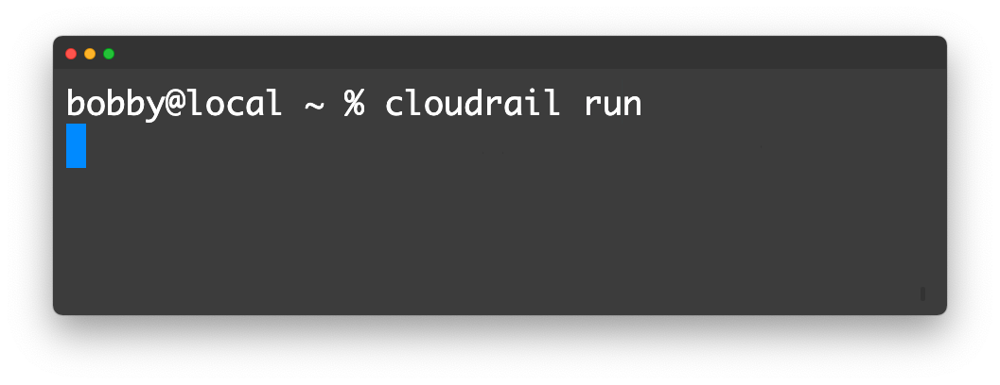
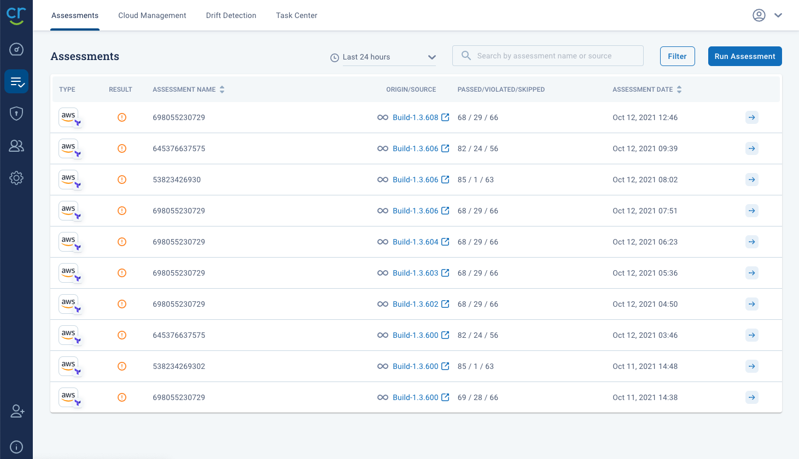

# Cloudrail Architecture
Cloudrail is a cloud-delivered service (SaaS) that exposes certain APIs to interact with the service, both for running IaC security scans and to interact with the web application. Users interact with the Cloudrail service through the Cloudrail CLI and Web Application. Cloudrail can also connect directly to your cloud accounts (AWS, GCP, Azure) for dynamic analysis.

## Connectivity into Cloudrail SaaS

### CLI
The Cloudrail CLI can be used either on your personal workstation to run assessments or in CI/CD tools to automatically run assessments based on certain git triggers (pull requests, commits, etc).



When a user runs a scan with the Cloudrail CLI, the CLI tool will interact with Cloudrail’s API services through the following endpoint:

```
Endpoints: https://api.cloudrail.app
Ports: 443 (HTTPS)
```

Note, all interactions are authorized using an API key that is provided for each Cloudrail user.

### Web Application
The Web Application is accessible via most browsers at https://web.cloudrail.app.



**Same Origin Policy**: Cloudrail has a strict same-origin policy, which may impact your access to the web application if you are using a proxy. You may want to avoid the use of proxy in such a case.

### From Cloudrail to your cloud accounts
Cloudrail will connect to the cloud accounts you configure. Depending on the cloud service provider (CSP), the method of connectivity will vary. For information on connecting clouds, check out our [Connecting Clouds section](/getting-started/connecting-clouds.md).
