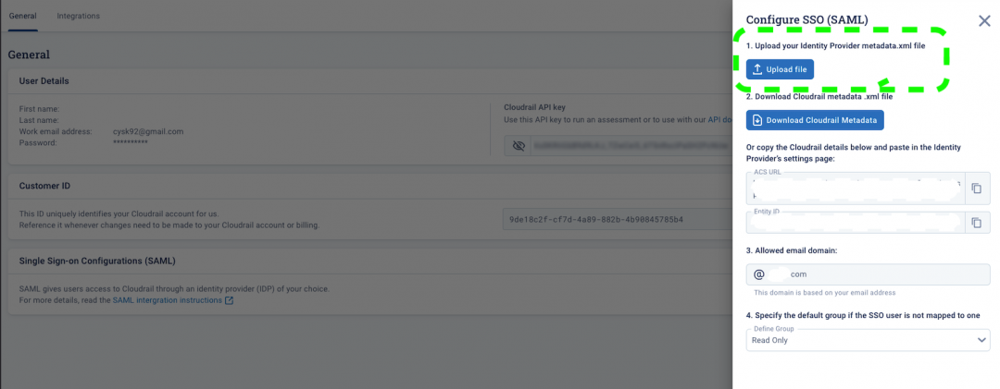
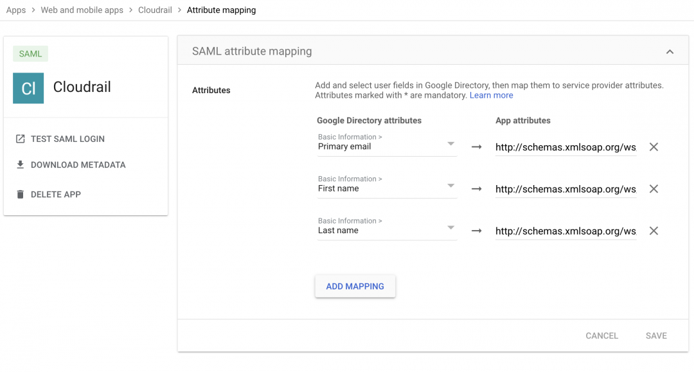
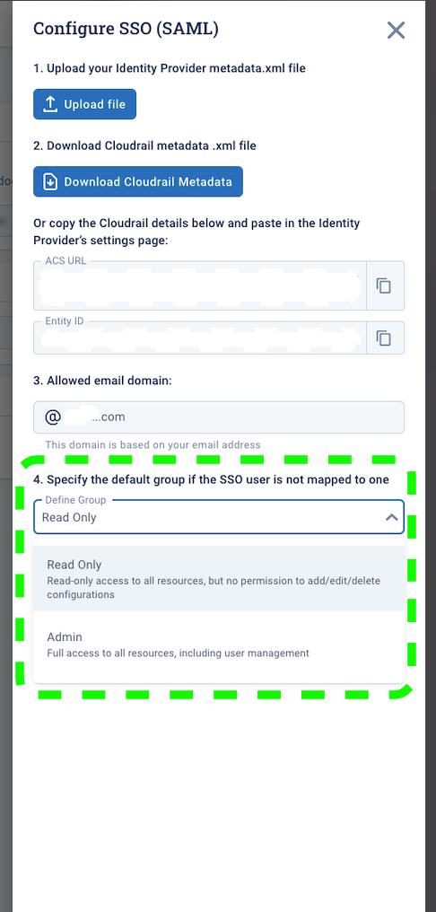

# Single Sign-On (SSO) with Cloudrail
Cloudrail currently supports Single Sign-On through the SAML protocol. At the moment, this feature is controlled under a feature flag.

## Enabling Single Sign-On (SSO)
Please reach out to support@cloudrail.app with your Cloudrail Customer ID (available in the settings tab) to have the feature enabled for your account.

## SSO Setup
For Cloudrail to integrate with your SSO provider, you will need to create a custom application inside your SSO provider’s portal. You can choose to name the custom application however you’d like, but many prefer to use “Cloudrail”

The following documents are references to some of the popular SSO providers used today:

- Okta
- Azure Active Directory
- Google SSO

Login to your Cloudrail instance and navigate to the General section of the Settings tab. Click on “Configure SSO” and Upload your Identity Provider metadata.xml file. If you can’t see “Configure SSO”, the feature was not enabled for you yet – see the note at the top of this section.



If the upload is successful, Cloudrail will now accept SAML responses from your identity provider moving forward and knows how to redirect your users to your identity provider’s login page.

The next step is to provide the Cloudrail parameters that are necessary for your Identity Provider’s SAML response. This can be done by downloading Cloudrail’s metadata XML and importing it to your Identity Provider during the custom application process if it’s supported by your Identity Provider. Otherwise, you may need to provide the fields manually, which are provided as well.

There are 3 fields that need to be filled:

- ACS URL
- Entity ID
- User attribute mappings

The ACS URL and Entity ID are auto-generated for you in the Cloudrail drawer, so you can copy those parameters during the custom application setup within your identity provider.

For the User attribute mappings, each identity provider defines the following fields under a different attribute, but they each must be mapped to the following XML schema:

```
First name – > http://schemas.xmlsoap.org/ws/2005/05/identity/claims/name 
Last name – > http://schemas.xmlsoap.org/ws/2005/05/identity/claims/surname
Email -> http://schemas.xmlsoap.org/ws/2005/05/identity/claims/emailaddress
```
Defining additional attribute mappings can look different for each provider, but the following will provide you an idea of how this can be mapped. The sample screenshot is from Google SSO.



Once the mapping is completed and you save your custom application in the Identity Provider’s portal, the integration with your SSO provider should be complete. The final step is determining the default role that users logging in via SSO should take:



You can test the integration by logging out of your Cloudrail instance, or using incognito mode, and trying to login to Cloudrail using the SSO login option.

