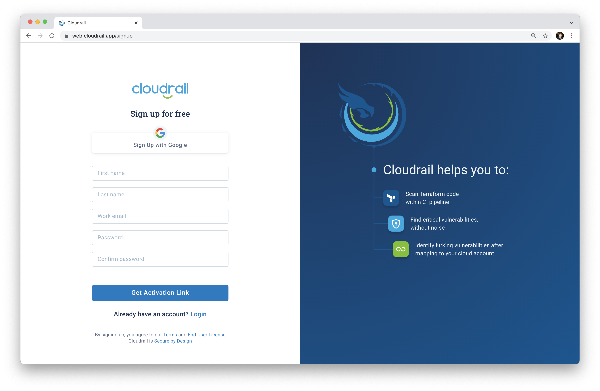

# Cloudrail Account Setup
The first step is to [sign up for a Cloudrail account](https://web.cloudrail.app/signup).

## Next Step
Once you've registered, move on to [the next step: Install the CLI](getting-started/install-cli.md).