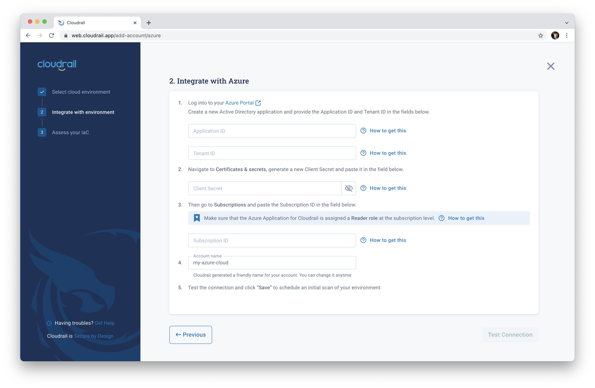

# Connecting Microsoft Azure to Cloudrail

## How To Connect Cloudrail To Your Microsoft Azure Account
In the cloudrail web application, navigate to the [Cloud Management tab](https://web.cloudrail.app/environments/cloud-management).

1. Click the ["Add Account" button](https://web.cloudrail.app/add-account) to be taken to the add account wizard.

2. Select `Microsoft Azure` as your cloud provider.

3. Follow the on-screen instructions to create a Cloudformation stack. Cloudrail will provide a link to launch a CloudFormation stack with the required information automatically populated.

## How It Works
Cloudrail connects through an Active Directory application, which needs to be provided with the Reader role. From here, cloudrail can audit the account for misconfigurations and drift.
