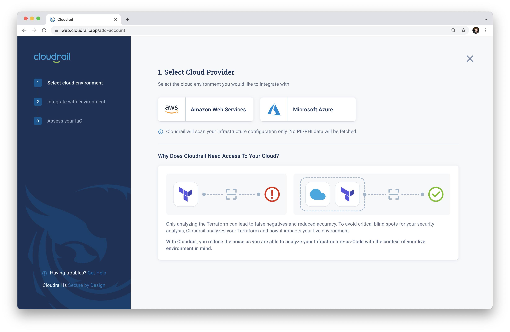

# Connecting Clouds
The Cloudrail command line tool can scan terraform files on your local machine, but by connecting a cloud account, many more things are possible.

## Why connect a cloud account?
When connected to a cloud account, cloudrail is able to continuously scan the account detecting new vulerabilities and drift. When changes are made to your infrastructure, cloudrail can perform `dynamic` and context-aware assessments, allowing you to view configurations in a broader context with existing resources.

After significant research by the cloudrail team, we've identified many blind spots between what's defined in a terraform file, and what's deployed in a live environment. For this reason, we recommend connecting cloud accounts to get the most comprehensive security analysis.

## How to connect your cloud account to Cloudrail
To connect your cloud account to Cloudrail, follow the instructions for each individual cloud:

- [Amazon Web Services (AWS)](getting-started/connecting-aws.md)
- [Microsoft Azure](getting-started/connecting-azure.md)
- Google Cloud Platform (GCP) - Coming Soon
