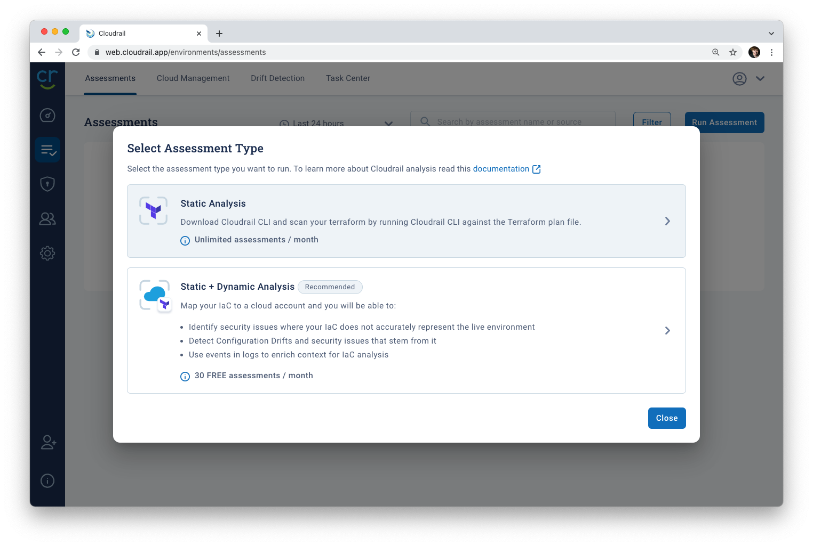

# Cloudrail Command Line Installation

Now that we've got our account setup, we can now install the command line tool to scan and secure local terraform files on your machine.

### Prerequisites
- [Cloudrail Account](getting-started/account-setup.md)

### Install the Cloudrail Command Line Tool (CLI)
First, install cloudrail to your local machine:

```bash
# Install cloudrail using python3
python3 -m pip install cloudrail --user
```

Try to run the following command:
```bash
# Check to see if cloudrail is installed
cloudrail --version
```

If you receive a command not found error, [you'll need to add the python directory to your path](misc/install/adding-cloudrail-to-your-path.md). Otherwise, you're good to continue.

### Add Your API Key
To complete the setup, we need to add the API key from our account to the CLI tool.

1. Navigate to the [web application](https://web.cloudrail.app/environments/assessments) and [go to the assessments tab](https://web.cloudrail.app/environments/assessments).

2. Click "Run Assessment" and choose "Static Analysis"



3. Select "Generate API Key" and copy that key to your clipboard.


4. Run the following command, replacing `<your_api_key>` with the API key copied to your clipboard.

```bash
cloudrail config set api_key=<your_api_key>
```

## Next Steps
Now that you've got the CLI installed, you're ready to [scan some terraform files](getting-started/basic-use.md).
