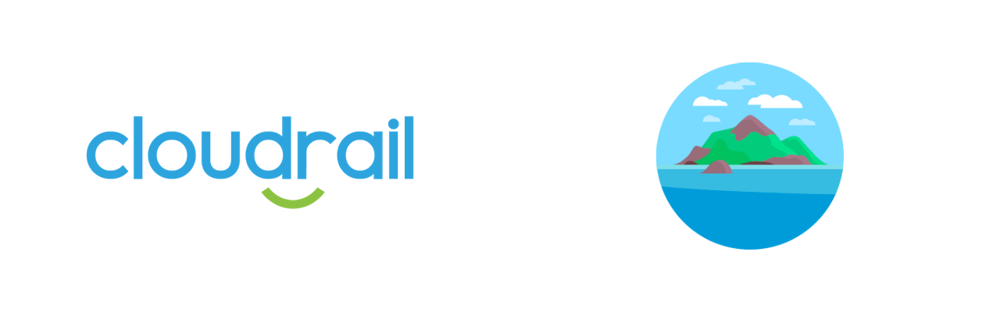

# Connecting Cloudrail to Atlantis




## How to connect Cloudrail to Atlantis
To execute Cloudrail within Atlantis, you’ll need the Cloudrail CLI installed and accessible within your execution environment. On a regular station, this would be achieved using pip install cloudrail. However, with Atlantis, it requires installing Python3, pip and the cloudrail package as part of the build of the Atlantis server or container.

If you use a container based on Alpine (like the container Atlantis offers in its releases), you could add these lines:

```dockerfile
RUN apk add --update --no-cache python3 && ln -sf python3 /usr/bin/python
RUN python3 -m ensurepip
RUN pip3 install --no-cache --upgrade pip setuptools
RUN pip install cloudrail
```

Whichever path you choose, make sure the cloudrail Python package is installed and accessible on the container or machine.

In addition, you will need your Cloudrail API key. The API key can be found in the Settings tab in the Cloudrail web interface. You’ll want to save this in a secure place in Atlantis (there are various ways, depending on how you set up your secret management). You’ll need the API key when adding the Cloudrail call further below.

Adding Cloudrail to a Custom Workflow:

Atlantis supports Custom Workflows. These are defined as part of the repos configuration (see Atlantis’ documentation on the --repo-config flag). In your repos configuration, add something like this:


```yaml
repos:
- id: /.*/
  workflow: my_custom
```

This tells Atlantis to run a custom workflow for a specific repo, or a set of them. In the above example we’ve chosen to do it for all repos, but you can change the value of the id of course.

Within the same repos configuration file, below the repos section, add your custom workflow:

```yaml
workflows:
  my_custom:
    plan:
      steps:
      - init
      - plan
 
      # Run Cloudrail with text output. If Cloudrail finds a violation of a mandated rule,
      # exit code 1 will be returned and the Atlantis execution will stop. The violations will
      # be listed in the output and displayed to the user (in the PR, for example).
      - run: >
          cloudrail run -p default.tfplan
          --origin ci 
          --execution-source-identifier "Atlantis ${HEAD_BRANCH_NAME}/${HEAD_COMMIT}"
          --build-link "https://github.com/${BASE_REPO_OWNER}/${BASE_REPO_NAME}/pull/${PULL_NUM}"
          --auto-approve
          --cloud-account-name account_name_in_cloudrail
          --api-key ${CLOUDRAIL_API_KEY}
```

The above will execute the Cloudrail CLI after the Terraform plan is done. It’s important that Cloudrail follows the plan creation, and not the other way around. If Cloudrail finds any rule violations for rules that are set to “mandate”, the execution will return exit code 1 and Atlantis will stop with an error. If Atlantis is set to trigger off PRs, it will post a comment to the PR with the details of what Cloudrail found and will block the PR from merging.

In the above usage, Cloudrail is providing a textual output of the issues it found which are easy to read.

NOTE:

Make sure to set an environment variable with CLOUDRAIL_API_KEY as it’s used in the command.

The --cloud-account-name flag is required if you have more than one cloud account added in Cloudrail. You may use the name, as it appears within the Cloudrail web interface, or the account ID using the --cloud-account-id flag (like 123456789012 if it’s an AWS account). You can also replace it with --no-cloud-account to run an analysis without cloud account information.

The --auto-approve flag tells Cloudrail to filter and then upload the filtered plan without asking for human approval. This is the standard way Cloudrail is used in CI.

By default, rules in Cloudrail are set to Advise. This means that if any of these rules are violated, the Atlantis plan workflow will not be stopped and the results can be viewed in the Cloudrail web interface. If you want to have Cloudrail stop code merges of insecure infrastructure, you can set a policy for the cloud account and decide which rules should be set to Mandate. If a violation is found in a rule that is set to Mandate, Atlantis will show an error at the Plan stage and it will look like this (screenshot is from a GitHub PR):


To resolve this, the developer simply needs to correct the security issue and push their code again. This will trigger the plan again (if it’s set to automatically trigger) and will run through Cloudrail automatically. If the violations are corrected, the plan will flow through successfully and the PR can be merged.

Advanced – Use the GitHub SARIF format

If you use GitHub for your code repository and run your pull requests there, you can also leverage the GitHub SARIF format. You can change the above mentioned custom workflow to this:


```yaml
workflows:
  my_custom:
    plan:
      steps:
      - init
      - plan
      # Run Cloudrail with SARIF output. This is very useful for GitHub PRs.
      # Since it requires uploading the SARIF output, we add the curl after it.
      # NOTE: Atlantis will stop execution if a command returns a non-zero exit code.
      # Since Cloudrail returns exit code 1 if it finds mandated violations, we upload the SARIF file
      # only if Cloudrail "failed" (exit code 1) and then bubble up the exit code.
      # See also https://docs.github.com/en/rest/reference/code-scanning#upload-an-analysis-as-sarif-data
      - run: >
          cloudrail run -p default.tfplan
          --origin ci 
          --execution-source-identifier "Atlantis ${HEAD_BRANCH_NAME}/${HEAD_COMMIT}"
          --build-link "https://github.com/${BASE_REPO_OWNER}/${BASE_REPO_NAME}/pull/${PULL_NUM}"
          --auto-approve
          --cloud-account-name account_name_in_cloudrail
          --api-key ${CLOUDRAIL_API_KEY}
          --output-format sarif
          --output-file cloudrail.sarif ||
          ( curl
          -X POST
          -H "Authorization: token mygithubtoken"
          -H "Accept: application/vnd.github.v3+json"
          https://api.github.com/repos/${BASE_REPO_OWNER}/${BASE_REPO_NAME}/code-scanning/sarifs
          -d '{"commit_sha":"'"${HEAD_COMMIT}"'","ref":"refs/pull/'"${PULL_NUM}"'/head","sarif":"'"`gzip -c cloudrail.sarif | base64 | tr -d '\n'`"'"}' > /dev/null &&
          echo "Cloudrail found violations in mandated rules, please review Code Scanning results" &&
          exit 1 )
```

In the above code, a few things are happening:

We’re running Cloudrail like before, but we’ve added the output format and output file.

If Cloudrail returns a non-zero exit code (which will happen if violations are found in mandated rules), the code will also post the SARIF results back to the PR that kicked off this workflow. Note that you should replace mygithubtoken with a GitHub token that has security_events permission on the repo. Cloudrail does not have any access to this token, it is used by your Atlantis instance only and is not sent to Cloudrail.
Note that sometimes the code scanning results may behave oddly and say “x analysis not found”. This happens because GitHub is attempting to compare the SARIF results from the PR with the SARIF results of the base branch (for example, main or master). If Cloudrail wasn’t run against the base branch, then GitHub cannot determine which issues are new and which are not. You can still click on the results though (see “Details”).

Viewing the SARIF results in the GitHub’s PR view makes it easier to understand what part of the code has the issue and what needs to be done to fix it.

