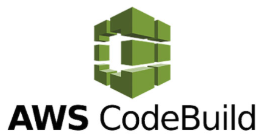

# Connecting Cloudrail with AWS CodeBuild
This tutorial walks through the process of setting up AWS CodeBuild with Cloudrail for performing security scans on infrastructure as code.



## How To Setup AWS CodeBuild with Cloudrail

### Update Your buildspec.yaml
Create or update the buildspec.yml file.

Define the phases for running the scan. Our recommendations are to:

1. Run the `terraform plan` command
2. Run Cloudrail

A sample of this is below

```yaml
phases:
  install:
    runtime-versions:
      nodejs: 12
    commands:
      # Docker requires the privileged flag in the CodeBuild configuration
      - docker info
  build:
    commands:
      # The example TF code we use here only works in v0.13, however Cloudrail supports 0.14 as well.
      - docker run --rm 
        -v $(pwd):/data -u $(id -u):$(id -g)
        -w /data
        -e AWS_DEFAULT_REGION -e AWS_CONTAINER_CREDENTIALS_RELATIVE_URI
        hashicorp/terraform:0.13.5 
        init

      # Cloudrail requires a Terraform plan as an input, so we must create a plan first.
      # Note we are picking a specific test to run against.
      - docker run --rm 
        -v $(pwd):/data -u $(id -u):$(id -g)
        -w /data
        -e AWS_DEFAULT_REGION -e AWS_CONTAINER_CREDENTIALS_RELATIVE_URI
        hashicorp/terraform:0.13.5 
        plan -out plan.out

      # This will run Cloudrail and produce JUnit results. These results are then uploaded into the Reports
      # function included in AWS CodeBuild. Note that only rules that are set to MANDATE will produce
      # JUnit test results. Rules that are set to ADVISE will not, and their results can be viewed in the 
      # Cloudrail Web UI.
      - docker run --rm
        -u $(id -u):$(id -g)
        -v $(pwd):/data 
        -e CLOUDRAIL_API_KEY
        indeni/cloudrail-cli
        run  --directory . --tf-plan "plan.out"
        --origin ci --build-link "https://console.aws.amazon.com/codesuite/codebuild/"
        --execution-source-identifier "${CODEBUILD_BUILD_ID}"  
        --output-format junit --output-file /data/cloudrail.result.xml 
        --auto-approve 

reports:
  CloudrailTest:
    files:
      - '**/cloudrail.result.xml'

```

### Reporting
The above example code will Cloudrail and produce a JUnit report that can be loaded into AWS CodeBuild reporting. If there are any rules that are set to MANDATE that are in violation, they will be listed in the "Report groups" view.

#### Parameters
These are the parameters being used for codebuild.

- `run` This command will run an evaluation of your Terraform plan.
- `--tf-plan plan.out` Here we’re providing Cloudrail with the plan file we generated. This plan file will be analyzed within the container, and then a filtered version of it (without sensitive data) will be uploaded to the Cloudrail Service for analysis.
- ` --directory .` Cloudrail needs to know where the root directory of the Terraform files is located.
- `--origin ci` This is required for all Cloudrail executions within CI.
- `--build-link "https://console.aws.amazon.com/codesuite/codebuild/"` This link will be included in the Cloudrail Web UI when displaying the results of this evaluation (called an Assessment). It will take you only to the AWS CodeBuild screen, from where you’ll need to find the build. Right now AWS CodeBuild does not provide an environment variable with the build URL.
- `--execution-source-identifier "${CODEBUILD_BUILD_ID}"` This identifier will show in the Cloudrail Web UI when listing Assessments, to make it easier to determine what job the Assessment was created for.
- `--output-format junit --output-file /data/cloudrail.result.xml` These two options together will tell Cloudrail to provide the results in JUnit XML format, as well as where to place the file for submission to the AWS CodeBuild system.
- `--auto-approve` If you would like, you can review the filtered Terraform plan prior to uploading it to the Cloudrail Service for analysis. However, it requires an interactive terminal, which generally isn’t available in CI. Alternatively, you can use the generate-filtered-plan command before run and then employ your own tool to auto-analyze the filtered plan.
- `-e CLOUDRAIL_API_KEY` This is a docker parameter, not a Cloudrail one, that passes an environment variable named CLOUDRAIL_API_KEY to the Cloudrail container. This allows you to set an environment variable within CodeBuild, and have it be passed to the container, which expects a variable under such a name. Alternatively, you could use --api-key.


Lastly, in order to have AWS CodeBuild load the JUnit results into a report, we added the reports section in the above code example. This will then cause AWS CodeBuild to stop the pipeline and provide the list of violations found, allowing developers to fix the violations.


## Notes

Please note that Cloudrail has other output formats as well, but JUnit is the one intended for AWS CodeBuild use.

Also note that rules that are set to Advise (which is the default) will not be included in the output by default.

For a working example, [visit the AWS CodeBuild CI file in our demo repository](https://github.com/indeni/cloudrail-demo/blob/master/buildspec.yml).
