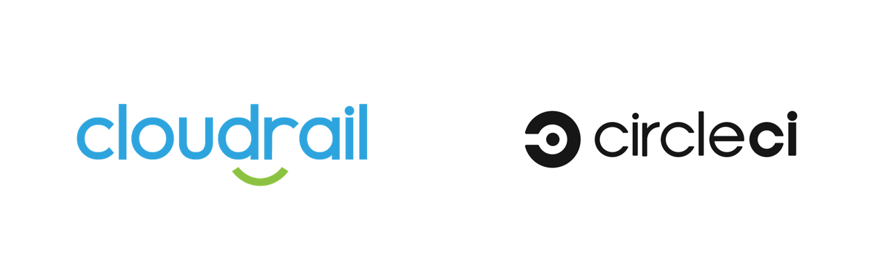

# Connecting Cloudrail with CircleCI

This tutorial walks through the process of setting up CircleCI with Cloudrail for performing security scans on infrastructure as code.

## How To Setup CircleCI with Cloudrail

Cloudrail maintains an orb with CircleCI to easily add in scanning to your deployment pipeline.
