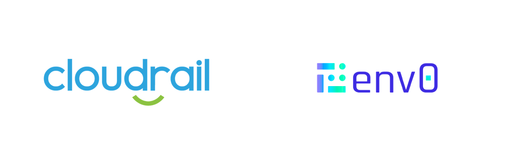

# Connecting Cloudrail with Env0



## How To Connect Env0 With Cloudrail


### Setting The API Key
To start, we need to set the `CLOUDRAIL_API_KEY` environment variable in the env0 Project Variables.

1. In the env0 interface, find the Project Variables, and within it the Environment Variables section.
2. There, click on Add Variable.
3. The Key is CLOUDRAIL_API_KEY, and the Value is your Cloudrail API key (this is available in the Cloudrail web interface).
4. Be sure to mark the variable as Sensitive and click on Save.

This will allow the Cloudrail CLI to make the required calls to the Cloudrail API.

### Creating the env0.yml file
Next, create an env0.yml file or update an existing one. 

Remember, the file needs to be at the root of your Terraform code within the repository. If, for example, your Terraform code is under a directory called terraform, the env0.yml needs to be inside that directory.

We will instruct env0 to run Cloudrail after the plan is ready, but before an apply takes place.

```yaml
# Example for how to run Cloudrail within env0
version: 1

deploy:
  steps:
    terraformPlan:
      after:
        - pip install cloudrail >/dev/null
        - >
          cloudrail run -p .tf-plan 
          --origin ci 
          --build-link "https://app.env0.com/p/${ENV0_PROJECT_ID}/environments/${ENV0_ENVIRONMENT_ID}"  
          --execution-source-identifier "${ENV0_ENVIRONMENT_ID}" 
          --auto-approve
          --cloud-account-name test_for_cloudrail-demo-repo 
```


### How the pipeline works

1. A terraform plan is created
2. The Cloudrail CLI is installed to the env0 container.
2. Cloudrail is run on the terraform plan. 

### Parameters Used
The cloudrail run command uses additional parameters in the above example: here's what they mean.


- `--auto-approve` Tells Cloudrail to filter and then upload the filtered plan without asking for human approval. This is the standard way Cloudrail is used in CI.

- `--cloud-account-name` Required if you have more than one cloud account added in Cloudrail. You may use the name, as it appears within the Cloudrail web interface, or the account ID using the --cloud-account-id flag (like 123456789012 if it’s an AWS account).


## Notes
By default, rules in Cloudrail are set to Advise. This means that if any of these rules are violated, the env0 environment deployment will not be stopped and the results can be viewed in the Cloudrail web interface.

If you want to have Cloudrail stop environment deployments of insecure infrastructure, you can set a policy for the cloud account and decide which rules should be set to Mandate. If a violation is found in a rule that is set to Mandate, the env0 environment deployment will be stopped.


By clicking on the row titled “After: Terraform Plan”, you can see the Cloudrail execution and the specific violations that were found under the Mandated rules. For example:


To resolve this, the developer simply needs to correct the security issue and push their code again. This will trigger the environment deployment again (if it’s set to automatically trigger) and will run through Cloudrail automatically. If the violations are corrected, the deployment will flow through successfully.
