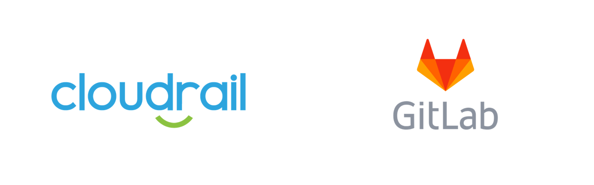

# Connecting Cloudrail with GitLab



## How To Connect GitLab with Cloudrail

First, make sure you have at least one GitLab Runner available in your GitLab CI if you're using self-managed GitLab. If you're using gitlab.com, a runner is managed for you.

Next, create a `.gitlab-ci.yml` file, or update an existing one.

You will need to define the terraform version to use. For example:

```yaml
image: registry.gitlab.com/gitlab-org/terraform-images/releases/0.13
```

You will also need to specify the directory where your terraform file exists. In the example below, the terraform file is in a subdirectory.

```yaml
variables: 
  TEST_ROOT:  ${CI_PROJECT_DIR}/test/aws/terraform/ec2_role_share_rule/public_and_private_ec2_same_role
```

Before scanning, descend into the directory with the terraform file:

```yaml
before_script: 
  - cd ${TEST_ROOT}
```

Next define the stages for running the scan.

- terraform plan
- cloudrail run (we will use the cloudrail CLI container)

```yaml
stages 
  - init_and_plan
  - cloudrail

init_and_plan: 
  stage: init_and_plan
  script: 
    - terraform init
    - terraform plan -out=plan.out
  artifacts: 
    name: "$CI_JOB_NAME"
    paths: 
      - ./**/plan.out
      - ./**/.terraform

cloudrail: 
  stage: cloudrail
  image: indeni/cloudrail-cli:latest
  script: 
    - cloudrail run --tf-plan plan.out --directory . --origin ci --build-link "$CI_PROJECT_URL/-/jobs/$CI_JOB_ID"  --execution-source-identifier "$CI_COMMIT_BRANCH - $CI_JOB_ID" --output-format json-gitlab-sast --output-file ${CI_PROJECT_DIR}/cloudrail-sast-report.json --auto-approve
  artifacts: 
    reports: 
      sast: 
        cloudrail-sast-report.json
    paths: 
      - cloudrail-sast-report.json
```

This will run Cloudrail and produce a SAST report according to GitLab’s requirements.

If there are any rules set to `MANDATE` with violations, they will be listed in the GitLab-SAST output and shown in the Security tab.

If you do not have the “Security Dashboard” feature, you may want to use the Test tab in GitLab, by changing the output format to junit:

```
cloudrail: 
  stage: cloudrail
  image: indeni/cloudrail-cli:latest
  script: 
    - cloudrail run --tf-plan plan.out --directory . --origin ci --build-link "$CI_PROJECT_URL/-/jobs/$CI_JOB_ID"  --execution-source-identifier "$CI_COMMIT_BRANCH - $CI_JOB_ID" --output-format junit --output-file ${CI_PROJECT_DIR}/cloudrail-junit-report.xml --auto-approve
  artifacts: 
    reports: 
      junit: 
        cloudrail-junit-report.xml
```

This will then cause GitLab to stop the pipeline and provide the list of violations found, allowing developers to fix the violations.

## Working Example
For a full working example, visit the [.gitlab-ci.yml file in our demo repository](https://github.com/indeni/cloudrail-demo/blob/master/.gitlab-ci.yml).

## Parameters Used
These are the parameters being used in the pipeline and an explanation behind them.

- `run` This command will run an evaluation of your Terraform plan.
- `--tf-plan plan.out` Here we’re providing Cloudrail with the plan file we generated. This plan file will be analyzed within the container, and then a filtered version of it (without sensitive data) will be uploaded to the Cloudrail Service for analysis.
- `--directory .` Cloudrail needs to know where the root directory of the Terraform files is located.
- `--origin ci` Required for all Cloudrail executions within CI.
- `--build-link "$CI_PROJECT_URL/-/jobs/$CI_JOB_ID"` This link will be included in the Cloudrail Web UI when displaying the results of this evaluation (called an Assessment). It will allow you to easily jump to your GitLab job from an Assessment.
- ` --execution-source-identifier "$CI_COMMIT_BRANCH - $CI_JOB_ID"` This identifier will show in the Cloudrail Web UI when listing Assessments, to make it easier to determine what job the Assessment was created for.
- `--output-format json-gitlab-sast --output-file ${CI_PROJECT_DIR}/cloudrail-sast-report.json` These two options together will tell Cloudrail to provide the results in GitLab’s SAST format, as well as where to place the file for submission to the GitLab system.
- `--auto-approve` If you would like, you can review the filtered Terraform plan prior to uploading it to the Cloudrail Service for analysis. However, it requires an interactive terminal, which generally isn’t available in CI. 
    - Alternatively, you can use the `generate-filtered-plan` command before run and then employ your own tool to auto-analyze the filtered plan.
This command assumes there is an environment variable named `CLOUDRAIL_API_KEY` that contains the API key for Cloudrail. You can also provide it by using `--api-key`

## Notes
Please note that Cloudrail has other output formats as well, but GitLab-SAST is the one intended for GitLab use.

Also note that rules that are set to Advise (which is the default) will not be included in the output by default.
