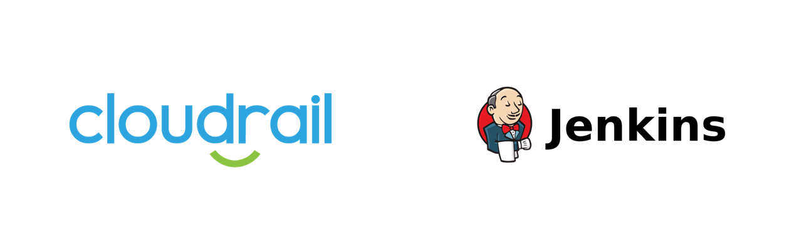

# Connecting Cloudrail with Jenkins
This tutorial walks through the process of setting up Jenkins with Cloudrail for performing security scans on infrastructure as code.



## How To Setup Jenkins with Cloudrail
First, create a Jenkinsfile file or update an existing one.

This pipeline will have two main stages – the first is to create a Terraform plan, and the second will be the execution of Cloudrail. The results of Cloudrail’s evaluation will be provided in the JUnit format. This way Jenkins can display them in a comfortable format for developers to understand and resolve failures.

Let’s start with the Terraform plan creation:

```groovy
stage('TF init and apply') {
    agent {
        docker {
            // The example TF code we use here only works in v0.13, however Cloudrail supports 0.14 as well.
            image 'hashicorp/terraform:0.13.5'
            // See https://stackoverflow.com/questions/52558150/jenkins-pipeline-docker-container-is-not-running
            args '-i --entrypoint='
        }
    }
    steps {
        // Cloudrail requires a Terraform plan as an input, so we must create a plan first.
        withAWS(credentials: 'ea752f11-606a-4dba-827d-524b6772d674', region: 'us-east-1'){
            // We're picking a specific test case to run against.
            sh '''
                cd test/aws/terraform/ec2_role_share_rule/public_and_private_ec2_same_role
                terraform init
                terraform plan -out=plan.out
            '''

            // We must stash the plan.out so it can be provided to the Cloudrail container
            stash includes: 'test/aws/terraform/ec2_role_share_rule/public_and_private_ec2_same_role/**', name: 'PLAN_OUT'
        }
    }
}
```

Next, run Cloudrail on the plan.out.


```groovy
stage('Cloudrail') {
    agent {
        docker {
            image 'indeni/cloudrail-cli:latest'
            args '-i --entrypoint=' // See https://stackoverflow.com/questions/52558150/jenkins-pipeline-docker-container-is-not-running
        }
    }
    environment {
        CLOUDRAIL_API_KEY = credentials('bdf6753e-05fe-47b2-9994-67e3ed4f2b9c')
    }
    steps {
        unstash 'PLAN_OUT'
        /**
            This will run Cloudrail and produce regular text results. The idea is that if there are any rules
            that are set to MANDATE, and they find violations, we will have "failed" tests in the textual output
            and a non-zero exit code.
            This will then cause Jenkins to stop the pipeline and list the failed results, allowing dev's to fix
            the violations.
            Also note that rules that are set to ADVISE (which is the default) will _not_ be included in the output by default.
        */
        sh '''
            cd test/aws/terraform/ec2_role_share_rule/public_and_private_ec2_same_role
            cloudrail run --directory . --tf-plan "plan.out" \
                --origin ci --build-link "${BUILD_URL}"  --execution-source-identifier "${BUILD_NUMBER}"  \
                --api-key "$CLOUDRAIL_API_KEY" \
                --output-format junit --output-file ${WORKSPACE}/cloudrail.result.xml \
                --auto-approve || exit $?
        '''
    }
}

```

This will run Cloudrail and produce a JUnit report. The idea is that rules that are set to Mandate will result in failed JUnit tests, which will stop the CI pipeline. This format makes it easy for developers to see what’s broken and how to fix it. These are the parameters being used:

- `run` This command will run an evaluation of your Terraform plan.
- `--tf-plan plan.out` Here we’re providing Cloudrail with the plan file we generated. This plan file will be analyzed within the container, and then a filtered version of it (without sensitive data) will be uploaded to the Cloudrail Service for analysis.
- `--directory .` Cloudrail needs to know where the root directory of the Terraform files is located.
- `--api-key ${CLOUDRAIL_API_KEY}` Your Cloudrail API key, generated through the Web UI.
- `--origin ci` Required for all Cloudrail executions within CI.
- `--build-link "${BUILD_URL}"` This link will be included in the Cloudrail Web UI when displaying the results of this evaluation (called an Assessment). It will allow you to easily jump to your Jenkins job from an Assessment.
- `--execution-source-identifier "${BUILD_NUMBER}"` This identifier will show in the Cloudrail Web UI when listing Assessments, to make it easier to determine what job the Assessment was created for.
- `--output-format junit --output-file ${WORKSPACE}/cloudrail.result.xml` These two options together will tell Cloudrail to provide the results in JUnit format, as well as where to place the file for ingestion by Jenkins.
- `--auto-approve` If you would like, you can review the filtered Terraform plan prior to uploading it to the Cloudrail Service for analysis. However, it requires an interactive terminal, which generally isn’t available in CI. Alternatively, you can use the generate-filtered-plan command before run and then employ your own tool to auto-analyze the filtered plan.

Often times you may want to wrap the Cloudrail stage in a try-catch, pass the JUnit results to the JUnit plugin and save the artifacts. Something like this:

```groovy
try {
        ... (code for running Cloudrail) ...
}
finally {
    archiveArtifacts allowEmptyArchive: true, artifacts: 'terraform.plan'
    junit allowEmptyResults: true, testResults: 'cloudrail.result.xml'
    archiveArtifacts allowEmptyArchive: true, artifacts: 'cloudrail.result.xml'
}
```