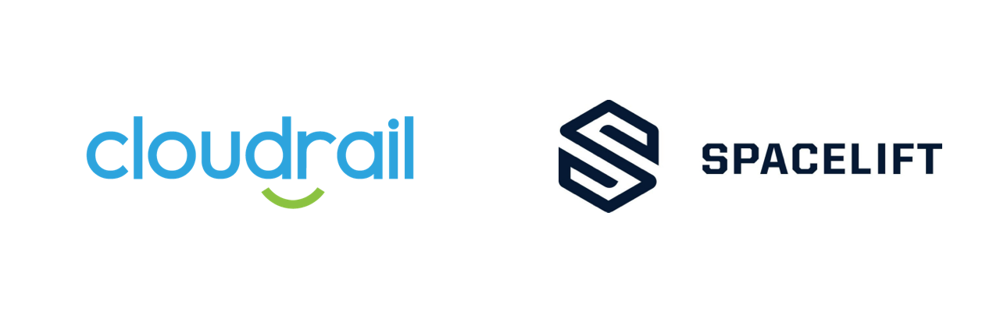

# Connecting Cloudrail with Spacelift
Cloudrail can easily connect with [Spacelift](https://spacelift.io/).




The instructions below refer to a public Git repository available here: https://github.com/indeni/cloudrail-spacelift

To use Cloudrail within Spacelift, you will need to create a custom container image. If you have one already, great, you can just add to it. In the custom container, we need to install pip and python (as these aren’t available in the default container), as well as Cloudrail’s CLI package:


```dockerfile
# There's no pip/python in the Spacelift image
USER root
RUN apk update \
  && apk add py3-pip bash vim less

# Install Cloudrail and clean up after
RUN umask 022
RUN pip install cloudrail
RUN pip cache purge
```

The container image needs to be posted to a container registry and shared publicly. For example, you can do this with AWS. Once you have the container available, follow these steps in the Spacelift web interface:

1. Within the Spacelift web interface, look for your stack. Click on it.

2. At the top look for Settings.

3. Look for the BEHAVIOR tab, click on it, then EDIT, and then EDIT BEHAVIOR at the bottom of the screen.

4. Replace the “Runner image” with the path to the container image you created above (for example public.ecr.aws/f8i6n0s5/cloudrail-spacelift:latest).

5. In the “After plan scripts” add this command:

```bash
cloudrail run -p spacelift.plan \
    --origin ci \
    --build-link "https://${TF_VAR_spacelift_account_name}.app.spacelift.io/stack/${TF_VAR_spacelift_stack_id}/run/${TF_VAR_spacelift_run_id}" \
    --execution-source-identifier "${TF_VAR_spacelift_commit_branch} - ${TF_VAR_spacelift_commit_sha}" \
    --auto-approve
```

6. Go back to the stack itself, and look for Environment at the top (it’s near the Settings tab you clicked on earlier).

7. Add an environment variable called `CLOUDRAIL_API_KEY`, with your Cloudrail API key (available from the Cloudrail web interface). Make sure to mark it as SECRET.

## How it works
If you are wondering how the “cloudrail” command works, it provides the Cloudrail CLI with the plan file, as well as additional information that will later be presented in the Cloudrail web interface.

The `--auto-approve` flag tells Cloudrail to filter and then upload the filtered plan without asking for human approval. This is the standard way Cloudrail is used in CI.

The `--cloud-account-name` flag is required if you have more than one cloud account added in Cloudrail. You may use the name, as it appears within the Cloudrail web interface, or the account ID using the `--cloud-account-id` flag (like 123456789012 if it’s an AWS account).


## Notes

By default, rules in Cloudrail are set to Advise. This means that if any of these rules are violated, the Spacelift stack trigger will not be stopped and the results can be viewed in the Cloudrail web interface.

If you want to have Cloudrail stop environment deployments of insecure infrastructure, you can set a policy for the cloud account and decide which rules should be set to Mandate. If a violation is found in a rule that is set to Mandate, the Spacelift stack deployment will be stopped and will look like this:

To resolve this, the developer simply needs to correct the security issue and push their code again. This will trigger the environment deployment again (if it’s set to automatically trigger) and will run through Cloudrail automatically. If the violations are corrected, the deployment will flow through successfully.
