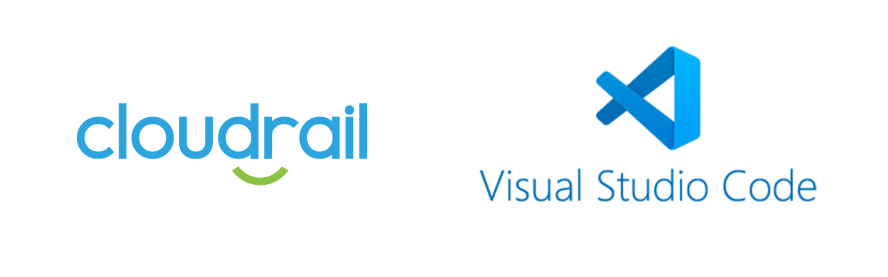

# Cloudrail Visual Studio Code Extension

Cloudrail maintains an [extension for Visual Studio Code](https://marketplace.visualstudio.com/items?itemName=Cloudrail.cloudrail-iac-scanning) to easily analyze your infrastructure as code for security issues - highlighting only those that are a true risk to your cloud environment.

[Get the extension here](https://marketplace.visualstudio.com/items?itemName=Cloudrail.cloudrail-iac-scanning).
